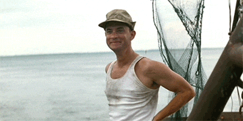

# Why your design system needs an API

---
layout: center
class: text-center bg-white
---
# Bonjour 👋

---
layout: illustration-aside
background: /assets/img/louis-chenais.jpg
---
# I'm Louis Chenais

Co-founder 
& Chief Evangelist

- W3C Design Tokens Community Group Member
- I also like ambient music and a nice côte de boeuf bien persillée

## Previously
Front-End Developer @ SportEasy, 5emeGauche & Ultranoir

## Find me on
- [@chuckn0risk](https://twitter.com/chuckn0risk)
- [lucho.cool](https://lucho.cool)

---
layout: illustration-aside
background: /assets/img/dtcg-logo-bg.jpg
---
# W3C   Design Tokens   Community Group   to the rescue!

---
layout: illustration-aside
background: /assets/img/design-tokens-bg.webp
---
# What's in store for us

1. Design tokens kézako?
2. What is a Design API?
3. Design tokens standardization
4. Demo of a Design API

---
layout: cover
background: /assets/img/encore_foundation.webp
---

---
layout: chapter
background: /assets/img/gradient.jpg
chapterNumber: 1
---
# Design tokens   kézako?

---
layout: center
class: text-center bg-white
---
# 🤔   What are design tokens?   What business issue do we want to address?